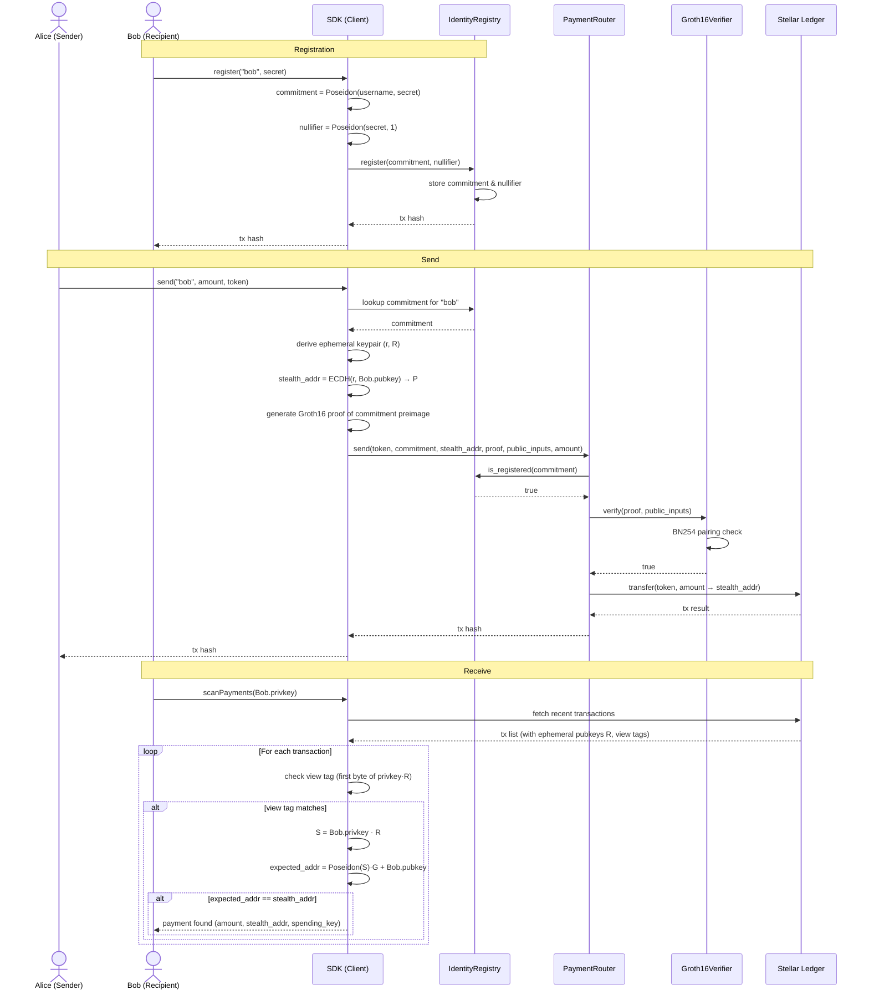

# Architecture

## Overview

This system adds a privacy layer on top of Stellar's public ledger. Users register
human-readable usernames. Payments are routed to one-time stealth addresses. No
wallet address ever appears in the transaction graph.

```
┌─────────────────────────────────────────────────────────────────┐
│  Client (browser / mobile)                                      │
│                                                                 │
│  sdk/src/commitment.ts  ──►  Poseidon(username, secret)         │
│  sdk/src/proof.ts       ──►  Groth16 proof (snarkjs, client-side)│
│  sdk/src/stealth.ts     ──►  Stealth address derivation (ECDH)  │
│  sdk/src/client.ts      ──►  Soroban RPC calls                  │
└────────────────────────────────┬────────────────────────────────┘
                                 │ Soroban transactions
                                 ▼
┌─────────────────────────────────────────────────────────────────┐
│  Stellar / Soroban (Protocol 25+)                               │
│                                                                 │
│  IdentityRegistry                                               │
│    register(commitment, nullifier)                              │
│    is_registered(commitment) → bool                             │
│                                                                 │
│  PaymentRouter                                                  │
│    send(token, commitment, stealth_addr, proof, inputs, amount) │
│      ├─ calls IdentityRegistry.is_registered                    │
│      ├─ calls Groth16Verifier.verify                            │
│      └─ transfers token to stealth_addr                         │
│                                                                 │
│  Groth16Verifier                                                │
│    verify(proof, public_inputs) → bool                          │
│      └─ uses native BN254 + Poseidon host functions             │
└─────────────────────────────────────────────────────────────────┘
```

## Full flow: register → send → receive



## Cryptographic primitives

| Primitive | Purpose | Where |
|---|---|---|
| Poseidon hash | ZK-friendly commitment H(username, secret) | circuits, SDK, Soroban host |
| Groth16 (BN254) | Succinct proof of commitment preimage knowledge | circuits, Groth16Verifier contract |
| ECDH (BabyJubJub) | Stealth address shared secret | circuits/stealth_address.circom, SDK |
| Pedersen commitment | Binding, hiding commitment scheme | conceptual layer over Poseidon |

## Data flow: registration

```
User                          SDK                     IdentityRegistry
 │                             │                              │
 │── username, secret ────────►│                              │
 │                             │ commitment = Poseidon(u, s)  │
 │                             │ nullifier  = Poseidon(s, 1)  │
 │                             │── register(c, n) ───────────►│
 │                             │                   store c, n │
 │◄── tx hash ─────────────────│◄─────────────────────────────│
```

## Data flow: payment

```
Sender                        SDK                  PaymentRouter   Groth16Verifier
 │                             │                        │                │
 │── recipient username ──────►│                        │                │
 │                             │ lookup commitment       │                │
 │                             │ derive stealth addr     │                │
 │                             │ generate Groth16 proof  │                │
 │                             │── send(proof, ...) ────►│                │
 │                             │                         │── verify ─────►│
 │                             │                         │◄── true ───────│
 │                             │                         │ transfer XLM   │
 │                             │                         │ to stealth addr│
 │◄── tx hash ─────────────────│◄────────────────────────│                │
```

## Stealth address scanning

The recipient runs `scanPayments` periodically. For each transaction:
1. Extract the ephemeral public key R from transaction metadata.
2. Compute shared secret S = privkey * R.
3. Derive expected stealth address P = Poseidon(S) * G + pubkey.
4. If P matches the payment destination, the payment belongs to this user.

A **view tag** (first byte of S) is published alongside R so recipients can
skip 99.6% of transactions without full ECDH computation.

## Security properties

| Property | Mechanism |
|---|---|
| Username privacy | Commitment is a one-way hash; username never stored on-chain |
| Sender privacy | Proof reveals nothing about sender identity |
| Receiver privacy | Stealth address is unlinkable to recipient's public key |
| Replay protection | Nullifiers prevent re-registration; TODO: add payment nullifiers |
| Soundness | Groth16 proof is computationally binding under BN254 DL assumption |

## Known limitations / open problems

- **Trusted setup**: Groth16 requires a per-circuit trusted setup ceremony.
  A multi-party computation (MPC) ceremony should be run before mainnet launch.
- **Stealth scanning cost**: Recipients must scan all transactions. View tags
  reduce this to O(n/256) but a dedicated scanning service would improve UX.
- **Amount privacy**: Payment amounts are currently public. Hiding amounts
  requires a range proof (e.g. Bulletproofs) — out of scope for v1.
- **Compliance**: Optional KYC hook (following Curvy Protocol's pattern) can
  be added to the IdentityRegistry without breaking the privacy model.
